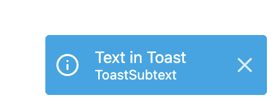

# Small React Component Library

A small **React component library** built with **Storybook**, featuring reusable UI components:

- Smart `Input` component
- `Toast` notifications
- Accordion-style `Sidebar Menu` with sliding animation

This project is built with **React**, **TypeScript**, and **Vite**, and demonstrates clean, modular, and reusable UI components.

INPUT COMPONENT

TOAST COMPONENT
INPUT COMPONENT

SIDEBAR COMPONENT

